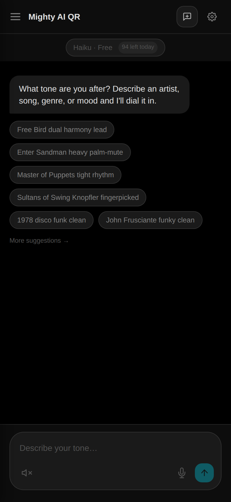
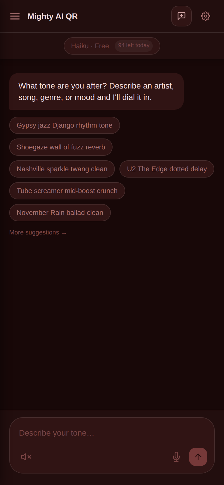
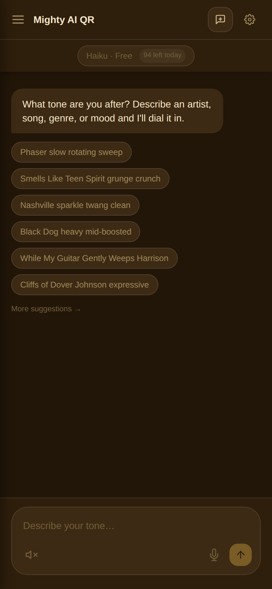
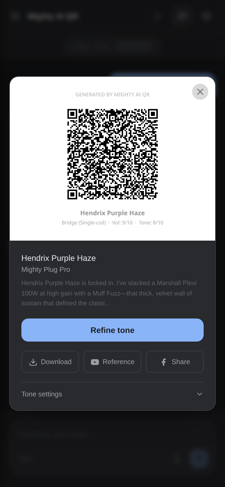
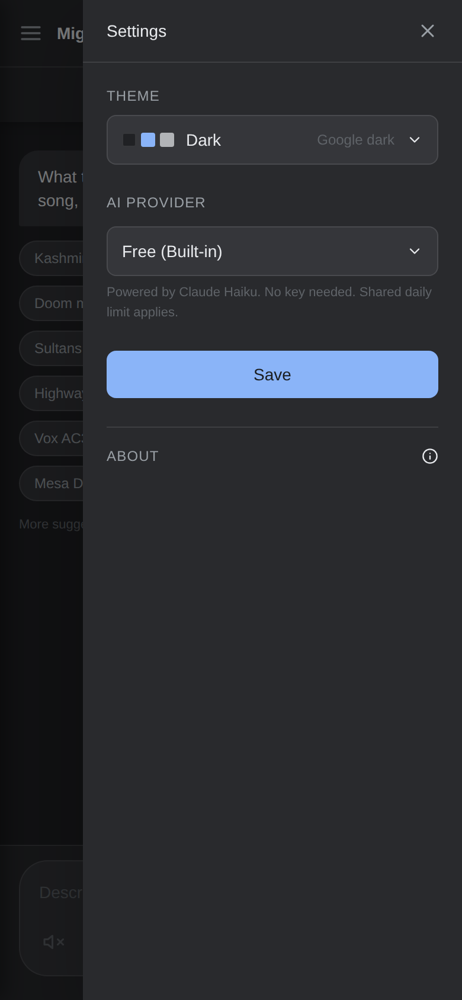

# Mighty AI QR — Web Client

[](LICENSE)
[](package.json)
[](https://mighty-ai-qr-web.onrender.com)

Describe a guitar or bass tone in natural language and get a scannable NUX MightyAmp QR code back. Chat with an AI, tap a suggestion, import an existing QR to decode and refine it, or convert a preset between devices — all in the browser. All 10 NUX MightyAmp models supported.

Installable as a PWA on mobile and desktop.

## Screenshots

<table>
  <tr>
    <td align="center"><br/><sub>OLED</sub></td>
    <td align="center"><br/><sub>Oxblood</sub></td>
    <td align="center"><br/><sub>Tweed</sub></td>
    <td align="center"><br/><sub>QR popup</sub></td>
    <td align="center"><br/><sub>Settings</sub></td>
  </tr>
</table>

## Stack

- **Next.js 15** (App Router, TypeScript, Tailwind CSS)
- **SQLite** via `node:sqlite` — conversations and QR history persisted server-side (Docker volume)
- **JWT auth** — device-scoped, no accounts required
- **Free tier** — shared daily quota powered by Claude Sonnet (server-side key); no API key needed
- **BYOK** — bring your own key for Anthropic, OpenAI, Gemini, Grok, Mistral, Groq, Ollama, LM Studio, Open WebUI
- **Web search** — optional Tavily integration; the AI searches the web for song/artist tone references before generating a QR code, grounding answers in real gear data beyond its training cutoff — especially important for obscure recordings, recent releases, and deep-cut tone research
- **Docker** — single container, SQLite volume

## Features

- Chat UI with markdown rendering, voice input (Web Speech API), TTS
- Inline QR code cards with tone settings, guitar recommendations, download, share
- **QR import** — scan an existing QR image to decode and save its settings
- **Convert presets between devices** — one tap to adapt any saved tone to your current device
- **Bass tones** — dedicated bass presets with the right amps, cabs, compressor, and effects; bassist on-ramp on suggestion screen
- Conversation history with rename (click pencil icon) and delete
- QR history sidebar with device grouping, collapse/expand all, rename, delete, and import
- **Unified sidebar search** — filter chats and QR codes as you type
- Suggestion chips on home screen (100+ randomised prompts)
- **Default NUX Device** setting — select your device once in Settings; the AI uses it as the default for all generated QR codes
- Device name baked into the QR code image (preset name + device + optional guitar setup)
- 19 themes — 3 standard (Dark, OLED, Light) + 8 dark vintage + 8 light vintage (sunlit variants of each amp theme), grouped in Settings
- **Web search sources panel** — when Tavily is configured and the AI searches the web, a collapsible sources bar with favicons appears below the response
- **Provider-coloured model pill** — header pill shows the active provider name in its brand colour (Anthropic orange, OpenAI green, Gemini blue, etc.)
- **Live quota pill** — free-tier remaining count updates immediately after each request and polls every 30s for multi-user accuracy
- Copy to clipboard on every chat bubble
- Cancel in-flight requests
- **PWA update banner** — detects new version in the background and prompts to refresh with one tap
- **Check for updates** — Settings button (PWA only) that manually triggers a service worker update check; if a new version is found the update banner appears and the app reloads automatically
- **Version stamped QR images** — every generated QR image includes the app version in the header

## Supported NUX Devices

### Pro format (113-byte payload) — full feature set
| Device | ID |
|---|---|
| Mighty Plug Pro | `plugpro` |
| Mighty Space | `space` |
| Mighty Lite MkII | `litemk2` |
| Mighty 8BT MkII | `8btmk2` |

29 amp models, 25 cabinets, compressor, EFX, modulation, delay, reverb, 5-band EQ.

### Standard format (40-byte payload)
| Device | ID | Notes |
|---|---|---|
| Mighty Air (v1 firmware) | `mightyair_v1` | 13 amps, 19 cabs, EFX slot (same format as Plug v1) |
| Mighty Air (v2 firmware) | `mightyair_v2` | Updated amps/effects (same format as Plug v2) |
| Mighty Plug (v1) | `plugair_v1` | 13 amps, 19 cabs, EFX slot |
| Mighty Plug (v2) | `plugair_v2` | Updated amp/mod/reverb set, 19 cabs |
| Mighty Lite BT | `lite` | 1 amp, single ambience slot (delay OR reverb) |
| Mighty 8BT | `8bt` | 1 amp, separate delay + reverb |
| Mighty 20/40BT | `2040bt` | 1 amp with full EQ, wah pedal |

## Requirements

- Docker

For self-hosted use with Caddy and an internal network, use `docker-compose.yml` (requires a `proxy_net` external Docker network).

For public hosting (Render, VPS), use `docker-compose.prod.yml` — no external network needed, includes Caddy with automatic HTTPS.

## Run (local)

```bash
docker compose up -d
```

Runs on port `3005`. Access via `https://mighty-qr.linux.internal` (requires Caddy + internal DNS).

## Deploy (public)

```bash
# Set your domain in Caddyfile, then:
docker compose -f docker-compose.prod.yml up -d
```

Or deploy to [Render](https://render.com): connect the repo, select Docker, add a persistent disk at `/data`, and set the environment variables below.

## Environment Variables

| Variable | Required | Description |
|---|---|---|
| `JWT_SECRET` | Yes | Secret for signing device tokens |
| `ANTHROPIC_API_KEY` | No | Server-side Anthropic key for free-tier requests. If unset, all users must supply their own key. |
| `FREE_DAILY_LIMIT` | No | Max free requests per day across all users (default `100`). Resets at midnight UTC. |
| `FREE_MODEL` | No | Anthropic model used for free-tier requests (default `claude-sonnet-4-6`). |
| `RUNNING_IN_DOCKER` | Auto | Set to `"true"` by docker-compose — rewrites `localhost` → `host.docker.internal` for local LLMs |
| `TAVILY_API_KEY` | No | Enables web search for song/artist tone lookups. Get a key at [tavily.com](https://tavily.com). If unset, web search is silently skipped. |
| `DB_PATH` | No | SQLite path (default `./data/mighty.db`) |

## Local LLMs (Ollama)

When running in Docker, the app rewrites `localhost` to `host.docker.internal` so local Ollama instances are reachable. Ollama must be configured to listen on all interfaces:

```ini
# /etc/systemd/system/ollama.service.d/override.conf
[Service]
Environment="OLLAMA_HOST=0.0.0.0:11434"
```

For AMD GPUs (RDNA 4), also add:

```ini
Environment="HSA_OVERRIDE_GFX_VERSION=12.0.0"
```

## Development

```bash
npm install
npm run dev
```

Runs on `http://localhost:3000`. SQLite is created at `./data/mighty.db`.

## Credits

QR format reverse-engineered from the NUX MightyAmp ecosystem. Special thanks to [tuntorius](https://github.com/tuntorius) for the open-source [mightier_amp](https://github.com/tuntorius/mightier_amp) app, which was an invaluable reference for the QR encoding format.
